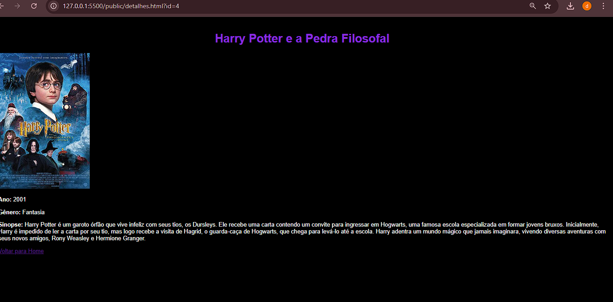

# Trabalho Prático 05 - Semanas 7 e 8

**Páginas de detalhes dinâmicas**

Nessa etapa, vamos evoluir o trabalho anterior, acrescentando a página de detalhes, conforme o  projeto escolhido. Imagine que a página principal (home-page) mostre um visão dos vários itens que existem no seu site. Ao clicar em um item, você é direcionado pra a página de detalhes. A página de detalhe vai mostrar todas as informações sobre o item do seu projeto. seja esse item uma notícia, filme, receita, lugar turístico ou evento.

Leia o enunciado completo no Canvas. 

**IMPORTANTE:** Assim como informado anteriormente, capriche na etapa pois você vai precisar dessa parte para as próximas semanas. 

**IMPORTANTE:** Você deve trabalhar e alterar apenas arquivos dentro da pasta **`public`,** mantendo os arquivos **`index.html`**, **`styles.css`** e **`app.js`** com estes nomes, conforme enunciado. Deixe todos os demais arquivos e pastas desse repositório inalterados. **PRESTE MUITA ATENÇÃO NISSO.**

## Informações Gerais

- Nome:Débora Luiza 
- Matricula:875055
- Proposta de projeto escolhida:
Catálogo de filmes
- Breve descrição sobre seu projeto:
Projeto de um catálogo de filmes com página inicial dinâmica e página de detalhes de cada filme.  
- **index.html**: lista todos os filmes com título, ano, gênero e resumo.  
- **detalhes.html**: mostra detalhes completos do filme, incluindo sinopse e imagem, com base no ID passado via query string.

## Print da Home-Page




## Cole aqui abaixo a estrutura JSON utilizada no app.js

```javascript
const filmes = [
  {
    id: 1,
    titulo: "O Senhor dos Anéis: A Sociedade do Anel",
    ano: 2001,
    genero: "Fantasia/Aventura",
    descricao: "Um grupo parte em uma jornada para destruir o Um Anel.",
    sinopse: "Em uma terra fantástica e única, um hobbit recebe de presente de seu tio um anel mágico e maligno que precisa ser destruído antes que caia nas mãos do mal. Para isso, o hobbit Frodo tem um caminho árduo pela frente, onde encontra perigo, medo e seres bizarros. Ao seu lado para o cumprimento desta jornada, ele aos poucos pode contar com outros hobbits, um elfo, um anão, dois humanos e um mago, totalizando nove seres que formam a Sociedade do Anel.",
    imagem:  "img/senhordosaneis.jpg"
  },
  {
    id: 2,
    titulo: "Interestelar",
    ano: 2014,
    genero: "Ficção Científica",
    descricao: "Exploradores viajam através de um buraco de minhoca em busca de um novo lar.",
    sinopse: "As reservas naturais da Terra estão chegando ao fim e um grupo de astronautas recebe a missão de verificar possíveis planetas para receberem a população mundial, possibilitando a continuação da espécie. Cooper é chamado para liderar o grupo e aceita a missão sabendo que pode nunca mais ver os filhos. Ao lado de Brand, Jenkins e Doyle, ele seguirá em busca de um novo lar.",
    imagem:  "img/Interstellar.png"
  },
  {
    id: 3,
    titulo: "Coringa",
    ano: 2019,
    genero: "Drama/Crime",
    descricao: "A origem sombria de um dos maiores vilões da cultura pop.",
    sinopse: "Isolado, intimidado e desconsiderado pela sociedade, o fracassado comediante Arthur Fleck inicia seu caminho como uma mente criminosa após assassinar três homens em pleno metrô. Sua ação inicia um movimento popular contra a elite de Gotham City, da qual Thomas Wayne é seu maior representante.",
    imagem:  "img/Joker.webp"
  },
  {
    id: 4,
    titulo: "Harry Potter e a Pedra Filosofal",
    ano: 2001,
    genero: "Fantasia/Aventura",
    descricao: "Harry descobre que é bruxo e enfrenta Voldemort pela primeira vez.",
    sinopse: "Harry Potter é um garoto órfão que vive infeliz com seus tios, os Dursleys. Ele recebe uma carta contendo um convite para ingressar em Hogwarts, uma famosa escola especializada em formar jovens bruxos. Inicialmente, Harry é impedido de ler a carta por seu tio, mas logo recebe a visita de Hagrid, o guarda-caça de Hogwarts, que chega para levá-lo até a escola. Harry adentra um mundo mágico que jamais imaginara, vivendo diversas aventuras com seus novos amigos, Rony Weasley e Hermione Granger.",
    imagem:  "img/Harry_Potter_Pedra_Filosofal_2001.jpg"
  }
];


```